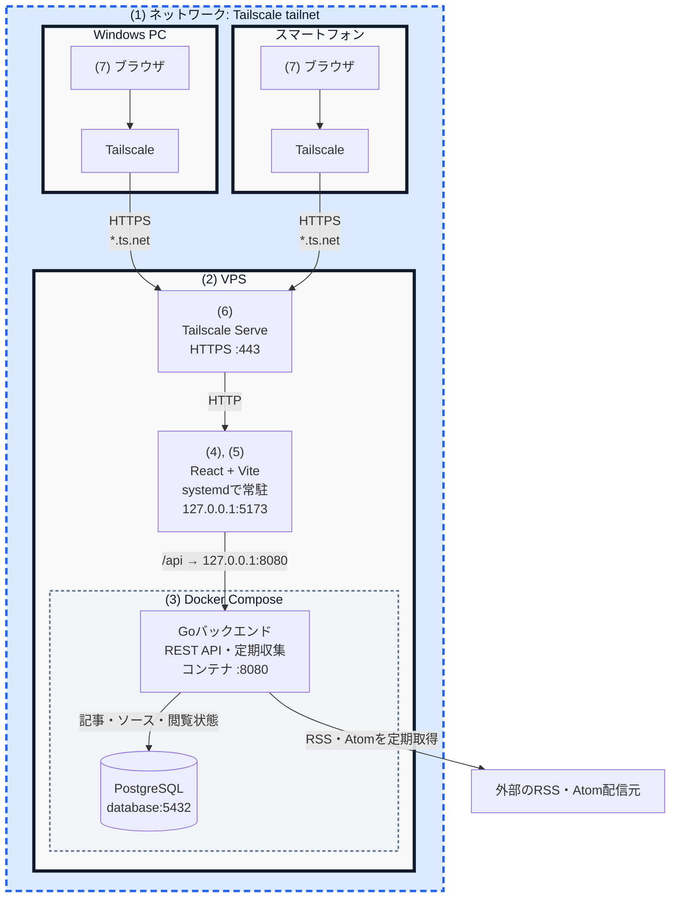

# fliqrss

RSS・Atomフィードからニュースを収集し, フリック操作で閲覧するWebアプリである.

## 構成

| 対象 | 採用技術 | 実行方法・役割 |
| --- | --- | --- |
| フロントエンド | TypeScript, React, Vite | Node.js上でViteを直接起動し, UIを配信する |
| バックエンド | Go | REST APIとRSS・Atomの定期収集を実行する |
| データベース | PostgreSQL | 記事, ソース, タグ, 閲覧状態を保存する |
| バックエンド実行環境 | Docker Compose | GoバックエンドとPostgreSQLを起動する |
| フロントエンド検証環境 | Node.js | VPS内でViteを直接起動する |
| プライベートネットワーク・HTTPS | Tailscale Serve | tailnet内からのHTTPS接続をViteへ中継する |

以下はUIをスマートフォンやPCから確認するための検証用デプロイ手順である.
Viteは`127.0.0.1:5173`, Goバックエンドは`127.0.0.1:8080`で待ち受ける.
利用端末とVPSを同じtailnetへ参加させ, Tailscale ServeのHTTPS URLからアクセスする.

### アクセス制御

本アプリには独自のログイン機能やユーザー認証機能はない.
利用者と端末の認証およびアクセス制御はTailscaleが担い, 同じtailnet内でアクセスを許可された端末から利用する構成である.
アクセスを許可する利用者, 端末および通信先は, Tailscaleの管理画面とアクセス制御設定で管理する.
アプリへアクセスできる端末からは, ニュースソースやタグの追加・変更・削除を含むすべての機能を操作できる.

図では, 太い実線の枠1つが1台の端末, 青い点線の外枠が同一のTailscaleネットワークを表す.
VPS端末内の細い点線の枠はDocker Composeによる実行単位を表す.



図中の`(1)`から`(7)`は, 後述する「構築手順」の番号に対応する.

## 必要なソフトウェア

- Git
- Docker EngineとDocker Compose
- Node.js 24系とnpm
- Tailscale

## 構築手順

### (1) TailscaleでVPSと利用端末を接続

UbuntuのVPSへTailscaleをインストールする.

```bash
curl -fsSL https://tailscale.com/install.sh | sh
sudo systemctl enable --now tailscaled
sudo tailscale up --hostname=fliqrss-vps
```

表示されたURLをブラウザで開き, 利用端末と同じTailscaleアカウントで認証する.
Tailscale管理画面のDNS設定でMagicDNSとHTTPS Certificatesを有効にする.

接続状態と割り当てられた名前を確認する.

```bash
tailscale status
tailscale ip -4
```

以降は, Tailscale管理画面に表示される完全修飾ドメイン名を
`fliqrss-vps.<tailnet-name>.ts.net`, HTTPS URLを
`https://fliqrss-vps.<tailnet-name>.ts.net`と表記する.
実際の設定では`<tailnet-name>`を自身の値へ置き換える.

### (2) VPSへリポジトリを配置

リポジトリを`ubuntu`ユーザーで配置する.

```bash
cd /opt
sudo install -d -o ubuntu -g ubuntu /opt/fliqrss
git clone git@github.com:BigTree777/fliqrss.git /opt/fliqrss
cd /opt/fliqrss
```

### (3) バックエンドとPostgreSQLを起動

環境変数を作成し, `POSTGRES_PASSWORD`を十分に長い値へ変更する.
`CORS_ORIGIN`にはTailscale ServeのHTTPS URLを指定する.

```bash
cp .env.example .env
chmod 600 .env
```

```env
POSTGRES_PASSWORD=change-this-password
BACKEND_PORT=8080
CORS_ORIGIN=https://fliqrss-vps.<tailnet-name>.ts.net
FEED_REFRESH_INTERVAL=15m
```

バックエンドとPostgreSQLを起動する.

```bash
docker compose up --build -d
docker compose ps
curl -fsS http://127.0.0.1:8080/api/v1/health
```

正常時は次のJSONを返す.

```json
{"data":{"status":"ok"}}
```

### (4) フロントエンドを配置

依存ライブラリを固定済みの`package-lock.json`からインストールする.

```bash
cd /opt/fliqrss/frontend
npm ci
cp .env.example .env.local
```

`.env.local`へViteの待受設定, Tailscaleのホスト名, APIの中継先を設定する.
`FRONTEND_ALLOWED_HOSTS`には完全修飾ドメイン名だけを指定する.

```env
FRONTEND_HOST=127.0.0.1
FRONTEND_PORT=5173
FRONTEND_ALLOWED_HOSTS=fliqrss-vps.<tailnet-name>.ts.net
BACKEND_PROXY_URL=http://127.0.0.1:8080
```

型検査後にViteを起動する.

```bash
npm run typecheck
npm run dev
```

別のSSH接続からVPS内の応答を確認する.

```bash
curl -I -H 'Host: fliqrss-vps.<tailnet-name>.ts.net' http://127.0.0.1:5173/
curl -fsS -H 'Host: fliqrss-vps.<tailnet-name>.ts.net' http://127.0.0.1:5173/api/v1/health
```

応答を確認したら`npm run dev`を`Ctrl+C`で終了し, `(5)`で常駐化する.

### (5) フロントエンドを常駐化

SSH切断後もUI検証を継続するため, systemdでViteを`ubuntu`ユーザーとして起動する.
`npm`のパスを確認する.

```bash
command -v npm
```

`/etc/systemd/system/fliqrss-frontend.service`を次の内容で作成する.
`ExecStart`には確認した`npm`のパスを指定する.

```ini
[Unit]
Description=fliqrss frontend for UI verification
After=network-online.target docker.service
Wants=network-online.target

[Service]
Type=simple
User=ubuntu
Group=ubuntu
WorkingDirectory=/opt/fliqrss/frontend
ExecStart=/usr/bin/npm run dev
Restart=on-failure
RestartSec=5

[Install]
WantedBy=multi-user.target
```

```bash
sudo systemctl daemon-reload
sudo systemctl enable --now fliqrss-frontend
sudo systemctl status fliqrss-frontend
```

ログは次のコマンドで確認する.

```bash
journalctl -u fliqrss-frontend -f
```

### (6) Tailscale Serveを設定

Tailscale ServeからViteへHTTPS通信を中継する.

```bash
sudo tailscale serve --bg http://127.0.0.1:5173
tailscale serve status
```

`--bg`で登録した設定はサーバ再起動後も復元される.

ServeとTailscaleの状態を確認する.

```bash
tailscale status
tailscale serve status
systemctl status tailscaled --no-pager
```

### (7) 利用端末から接続を確認

`(1)`で同じtailnetへ参加させた利用端末から, 次のURLをブラウザで開く.

```text
https://fliqrss-vps.<tailnet-name>.ts.net
```

WindowsのPowerShellから接続とAPIを確認できる.

```powershell
tailscale ping fliqrss-vps
curl.exe https://fliqrss-vps.<tailnet-name>.ts.net/api/v1/health
```

## 更新

ローカルでpushした変更をVPSへ反映する.
初回のみリポジトリを更新して, 更新スクリプトを実行する.

```bash
cd /opt/fliqrss
git pull --ff-only
./scripts/update.sh
```

2回目以降は更新スクリプトだけを実行する.

```bash
cd /opt/fliqrss
./scripts/update.sh
```

スクリプトは`git pull --ff-only`を実行し, 最後に適用したコミットからの変更内容に応じて次の処理を行う.

- `backend/`の変更時はバックエンドだけを再ビルドする.
- `compose.yaml`の変更時はComposeサービス全体を更新する.
- `frontend/`の変更時は型検査後に`fliqrss-frontend`を再起動する.
- `package.json`または`package-lock.json`の変更時は`npm ci`も実行する.
- バックエンド更新時はコンテナ内のヘルスチェック完了を待つ.

一般ユーザーで実行した場合, フロントエンドの再起動と起動確認には内部で次のコマンドを使用する.
そのため実行ユーザーには`sudo`権限が必要であり, 設定によっては更新中にパスワード入力を求められる.

```bash
sudo systemctl restart fliqrss-frontend
sudo systemctl is-active --quiet fliqrss-frontend
```

最終適用コミットは`.git/fliqrss-deployed-revision`へ保存する.
処理が途中で失敗した場合は記録を更新しないため, 問題を解消して再実行すると未適用分を再処理する.
作業ツリーに未コミットまたは未追跡ファイルがある場合は安全のため更新を開始しない.

起動状態を追加で確認する場合は次を実行する.

```bash
cd /opt/fliqrss
docker compose ps
docker compose logs --since=5m backend
systemctl status fliqrss-frontend --no-pager
tailscale serve status
curl -fsS https://fliqrss-vps.<tailnet-name>.ts.net/api/v1/health
```

## テスト

バックエンドとPostgreSQLの統合テストを実行する.

```bash
cd /opt/fliqrss
docker compose --profile test run --rm backend-test
```

フロントエンドの型検査と本番ビルドを確認する.

```bash
cd /opt/fliqrss/frontend
npm run typecheck
npm run build
```
